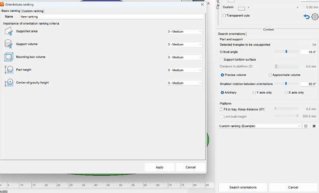
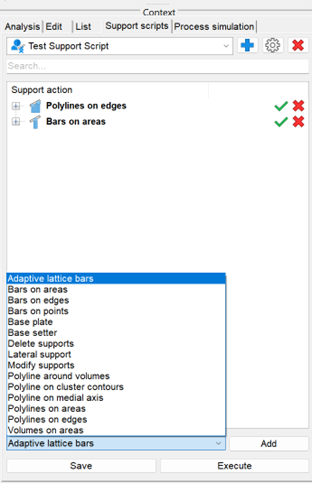
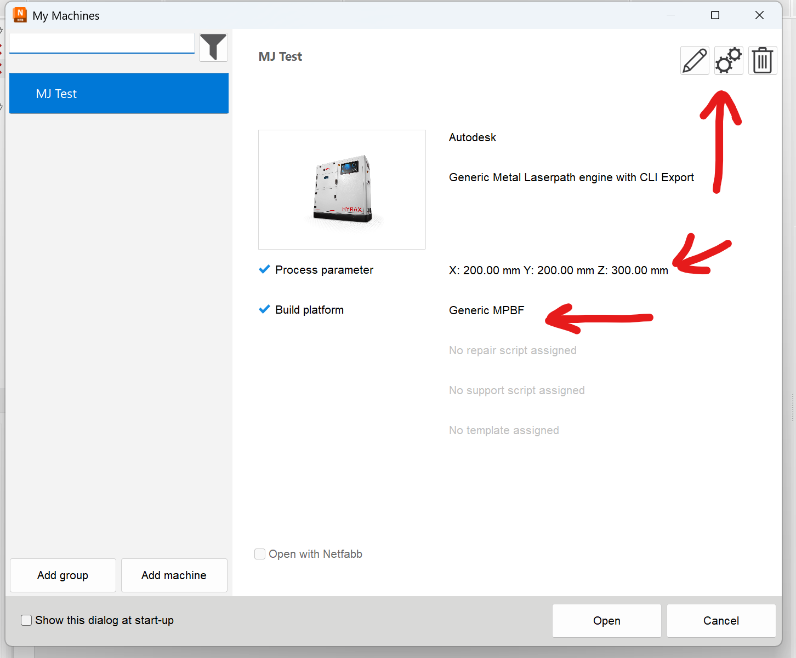
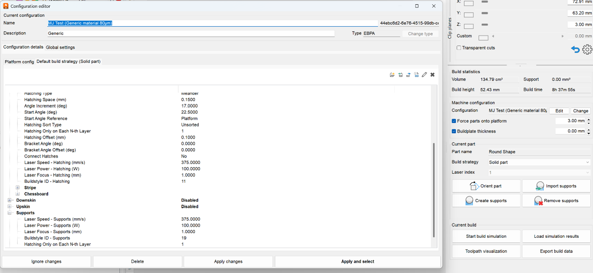

# Netfabb Notes and General Information

## Introduction
The scripts in this repository were written with the intention of making the quoting process easier. The goal is to quickly output a rough support and rough price estimation.
*   **Input**: Client part files.
*   **Output**: Finished statistics CSV (containing build time, support volume, part volume, and outbox volume of the tray).

## Orientation and Support
The orientation and support addition are left to be done by the program, the employee, and the support scripts.
*   There are heavy employee choices involved in this process.
*   Automatic orientation is an extremely difficult task to program (see Help | PartOrienter | Autodesk).
*   The part orienter in the Desktop Environment gives multiple options for ease of choice.

## Custom Machine Configuration
For the custom machine, there is a file named `No_Build` that needs to be accessed via a file path every time a new machine is opened.

## Resources
The most helpful place to search for functions and documentation is:
[Autodesk Netfabb Help](https://help.autodesk.com/view/NETF/2024/ENU/)

## Time Estimates
Maarten and Fanie walked through the parameters that get the time estimates.
*   There will be a PDF named "Time Estimate Review Unsurety Document.pdf" that contains the diagnosis.

---

## Guides

### How to edit the machine and no build zone

### The .support scripts

### The time estimate parameters

### The orientation rankings

